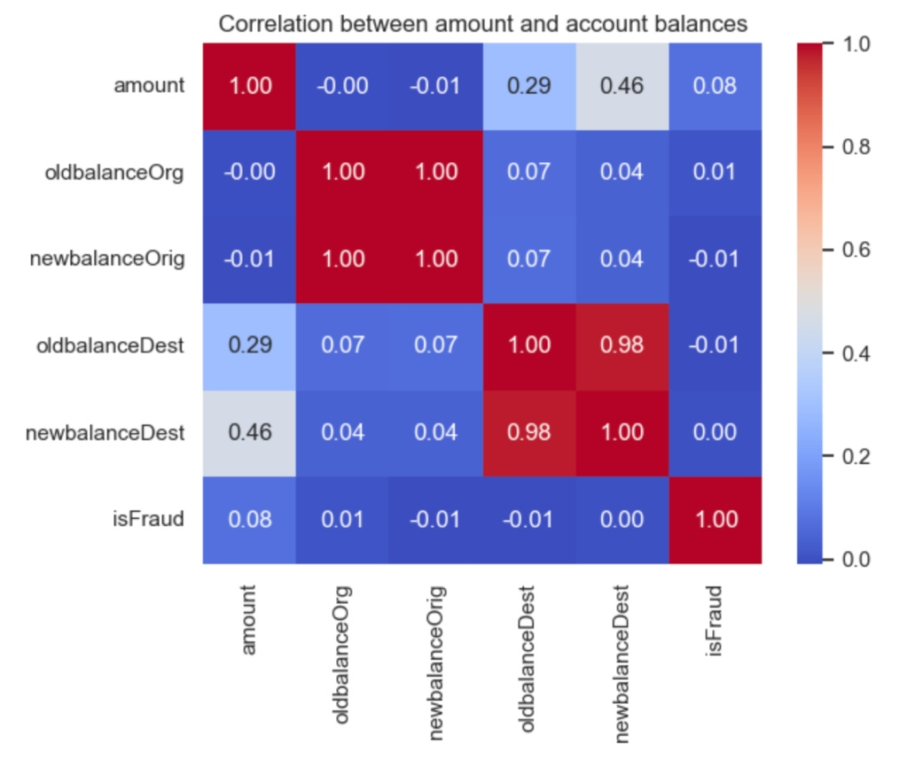

# Fraud Detection Prediction App

## Problem Statement

Financial institutions lose billions annually to fraudulent credit transactions. The challenge lies in the class imbalance of transaction data — where legitimate transactions vastly outnumber fraudulent ones — and the need for interpretable models that allow risk officers to understand why a transaction was flagged.

This project develops an end-to-end pipeline to identify high-risk behavioral patterns and deploy a real-time prediction interface for fraud risk assessment.

## Methodology & Technical Stack

The project follows a rigorous data science lifecycle, emphasizing statistical validation and robust feature engineering.

(1) Data Processing: Utilized pandas and numpy for data cleaning and handling missing values.

(2) EDA: Conducted exploratory analysis to identify key fraud indicators (e.g., transaction amount spikes, geographical anomalies).

(3) Feature Engineering: Developed predictive features and utilized a scikit-learn pipeline for consistent data transformation.

(4) Modeling: Implemented a Logistic Regression classifier, chosen for its interpretability in a risk management context.

(5) Validation: Applied K-Fold Cross-Validation to ensure model reliability across different data segments.

## Results & Key Findings

(1) **Transaction Type Vulnerability**
Fraud is not uniformly distributed across all transaction categories. Analysis shows that TRANSFER and CASH_OUT types are the primary vehicles for fraudulent activity.

Insight: While other transaction types (like PAYMENT or CASH_IN) show near-zero fraud rates, nearly all fraudulent flags in this dataset are concentrated in these two specific high-velocity categories.

(2) **Balance Discrepancies & "Emptying" Behavior**
A significant indicator of fraud was the relationship between the origin account's initial balance (oldbalanceOrg) and the destination account's change in balance.

Insight: Many fraudulent transactions involve a total depletion of the origin account, where the newbalanceOrig drops to zero regardless of the transaction amount, a classic sign of unauthorized account takeover.

(3) **Feature Correlations**
The correlation matrix identified strong linear relationships between certain variables that were later utilized for feature engineering:
- High Multicollinearity: A near-perfect correlation (0.98–1.0) exists between oldbalanceDest and newbalanceDest, which necessitated careful feature selection to prevent model overfitting.
- Fraud Predictors: The amount of the transaction showed the strongest positive correlation with the isFraud label compared to other raw variables.

## Discussion

While the Logistic Regression model provides a strong baseline with high interpretability, future iterations could explore:

(1) SMOTE (Synthetic Minority Over-sampling Technique): To better address the inherent class imbalance in fraud datasets.

(2) Ensemble Methods: Testing Random Forests or XGBoost to capture non-linear relationships, while using SHAP values to maintain transparency.

(3) Real-time Latency: Optimizing the pipeline for sub-second inference in a production environment.

## Resources and Appendix

To access the original dataset, please download via this link: https://www.kaggle.com/datasets/amanalisiddiqui/fraud-detection-dataset

This is a learning project inspired by Data Science by Onur. 
